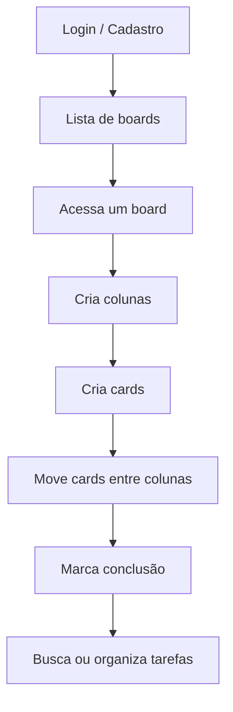

# Visão geral do produto

## Objetivo

O Krux foi pensado como um gerenciador de tarefas visual e simples, com foco em produtividade e menor complexidade para pequenos grupos e usuários individuais.

A proposta do produto é manter o que é essencial em um quadro Kanban:

- criação de boards
- organização por colunas
- movimentação de cards
- rastreio do progresso
- busca rápida
- experiência ágil e responsiva

## Público-alvo

- pessoas que organizam tarefas pessoais
- pequenas equipes
- times internos
- usuários que querem uma ferramenta minimalista e objetiva

## Diferenciais identificados no projeto

- autenticação com Google e credenciais próprias
- uso de Server Actions do Next.js
- cache inteligente com TanStack Query
- drag-and-drop de cards e colunas
- ordem por posições em ponto flutuante
- busca global por board, coluna e card
- aplicação moderna e responsive

## Fluxo principal do usuário

## Funcionalidades principais

### Boards

- criação de boards por usuário
- board principal de tarefas pessoais
- board Inbox para tarefas rápidas

### Colunas

- criação e edição de títulos
- ordenação das colunas
- exclusão com remoção em cascata

### Cards

- criação com título
- descrição opcional
- marcação como concluído
- posicionamento em coluna
- rearranjo por drag-and-drop

### Busca global

A busca global consulta boards, colunas e cards do usuário autenticado. O projeto limita os resultados para manter a interface leve.

## Casos de uso

### Caso 1: planejamento de tarefas semanais

Um usuário cria um board para a semana e organiza tarefas em colunas como:

- À fazer
- Em andamento
- Concluído

### Caso 2: tarefas rápidas

Se o usuário precisa registrar algo rápido, o sistema pode usar o board Inbox para registrar a atividade sem atrapalhar o fluxo principal.

### Caso 3: priorização e reordenação

Ao arrastar tarefas entre colunas e reorganizar cards, o usuário consegue ajustar rapidamente prioridades e progresso.

## Observações

Algumas ideias mencionadas no README, como colaboração em tempo real e compartilhamento de boards, foram descritas como roadmap, mas não foram confirmadas como implementadas na análise atual do código.

## Próxima página

- [Arquitetura do sistema](./02-arquitetura.md)
