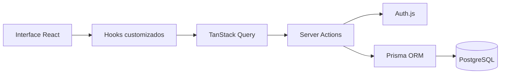

# Arquitetura do sistema

## Visão geral

O projeto usa o Next.js com App Router como base da aplicação full-stack. A arquitetura foi pensada para centralizar as regras de negócio em Server Actions, mantendo a interface enxuta e reduzindo a necessidade de uma API REST separada.

## Estrutura do repositório

```text
/
├── auth.ts
├── prisma.ts
├── prisma.config.ts
├── prisma/
│   └── schema.prisma
├── public/
├── src/
│   ├── actions/
│   ├── app/
│   ├── components/
│   ├── constrants/
│   ├── generated/
│   ├── hooks/
│   ├── libs/
│   ├── providers/
│   ├── types/
│   ├── proxy.ts
│   ├── setupTests.ts
│   └── ...
├── next.config.ts
├── package.json
├── tsconfig.json
├── vitest.config.mts
├── README.md
└── ...
```

## Camadas principais

### 1. Camada de apresentação

Localizada em:

- `src/app/`
- `src/components/`
- `src/app/home/components/`

Responsável por:

- renderização das páginas
- formulários
- menus
- componentes de UI e feedback
- layout global

### 2. Camada de regras de negócio

Localizada em:

- `src/actions/`

Aqui ficam as Server Actions que fazem:

- criação de boards
- criação de colunas
- criação de cards
- edição e exclusão
- busca global
- verificação de sessão
- proteção de acesso

### 3. Camada de persistência

Localizada em:

- `prisma/schema.prisma`
- `prisma.ts`
- `prisma.config.ts`

Responsável pela conexão e modelagem do banco PostgreSQL usando Prisma.

### 4. Camada de autenticação

Resumo das principais partes:

- `auth.ts`
- `src/proxy.ts`
- `src/types/AuthErrors.ts`

A autenticação utiliza Auth.js e implementa login por:

- Google OAuth
- e-mail + senha

## Fluxo de dados



## Autorização e proteção de rotas

A proteção de rotas é feita por `src/proxy.ts`, que redireciona usuários não autenticados ou ainda não verificados.

Rotas privadas principais:

- `/home`
- `/profile`
- `/board`

Rotas públicas principais:

- `/login`
- `/signin`

## Gestão de estado

A aplicação usa `@tanstack/react-query` para:

- cache de consultas
- invalidação de dados
- ações assíncronas
- updates otimizados

## Observações de arquitetura

- Não há API REST principal para o domínio do produto; a lógica relevante está encapsulada em Server Actions.
- A ordenação de cards e colunas é feita por campos numéricos (`position`, `order`).
- A aplicação depende fortemente de sessões autenticadas para acessar dados e executar operações.

## Próxima página

- [Configuração do ambiente](./03-configuracao.md)
