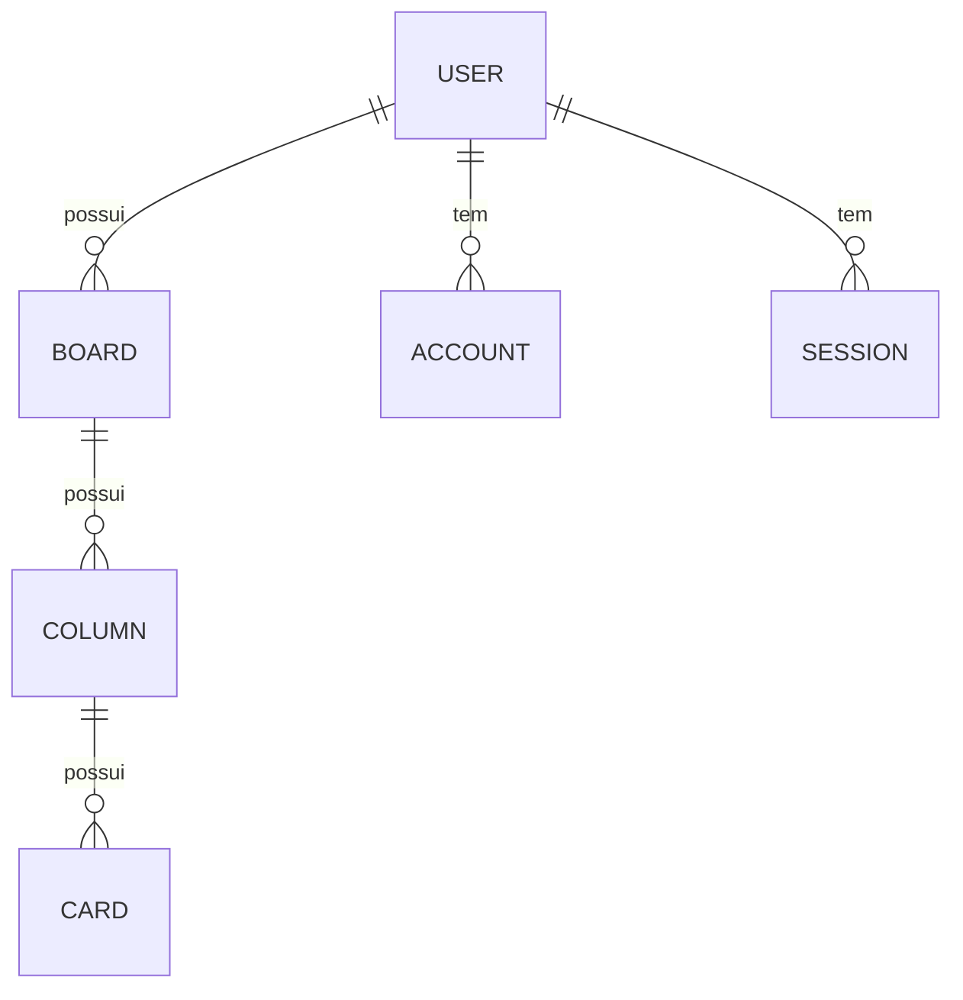

# Banco de dados

## Tecnologia

O projeto utiliza:

- PostgreSQL
- Prisma ORM
- Prisma Accelerate / Adapter Neon

O schema principal está em:

- `prisma/schema.prisma`

## Modelos principais

### User

Representa o usuário da aplicação.

Principais campos:

- `id`
- `name`
- `email`
- `password`
- `emailVerified`
- `image`
- `createdAt`
- `updatedAt`

Relacionamentos:

- `Account[]`
- `Session[]`
- `Authenticator[]`
- `Board[]`

### Account

Armazena as contas vinculadas a provedores externos do Auth.js, como Google.

### Session

Armazena as sessões do usuário autenticado.

### VerificationToken

Usado em fluxos de verificação de conta.

### Board

Representa um quadro Kanban do usuário.

Campos principais:

- `id`
- `title`
- `isInbox`
- `ownerId`
- `createdAt`
- `updatedAt`

### Column

Representa uma coluna dentro do board.

Campos principais:

- `id`
- `title`
- `order`
- `boardId`

### Card

Representa uma tarefa do board.

Campos principais:

- `id`
- `title`
- `description`
- `completed`
- `position`
- `columnId`
- `createdAt`
- `updatedAt`

## Relacionamentos



## Estratégia de ordenação

A ordenação é feita por campos numéricos:

- `order` para colunas
- `position` para cards

Isso permite reposicionar os itens sem precisar reindexar todos os registros em cada movimento.

## Cascata de exclusão

O schema define remoção em cascata em várias relações, então:

- ao excluir um usuário, seus boards também podem ser removidos
- ao excluir um board, suas colunas e cards são removidos
- ao excluir uma coluna, seus cards são removidos

## Comandos úteis do Prisma

```bash
npx prisma generate
npx prisma migrate dev
npx prisma migrate deploy
npx prisma studio
```

## Observações

A implementação atual mostra uma estrutura sólida para o domínio do Kanban, com persistência relacional simples e adequada ao fluxo do produto.

## Próxima página

- [Autenticação e segurança](./05-autenticacao-seguranca.md)
